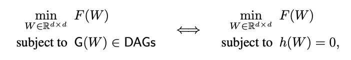

# NOTEARS

Es un algoritmo que intenta estimar la estructura de DAGs.

Pasa de optimizar una matriz dado una serie de caminos posibles (combinatorial optimization), a optimizar una matriz sujeta a una función igualada a 0 (lo que representa un grafo acíclico.)

Donde *G(W)* representa un nodo en la matriz de adyacencia *W*, *F* es una función de puntajes y *h* es una función suave igualada a 0.

La ventaja del segundo enfoque es que elimina la necesidad de algoritmos especializados en buscar en el espacio muestral del DAG.

* NP-Hard problem: un problema que se resuelve en polynomial time (time=complexity^2)
* Combinatorial optimization: encontrar un objeto optimo en un espacio limitado de objetos (conjunto discreto) <- asi se suelen hacer los DAGs
